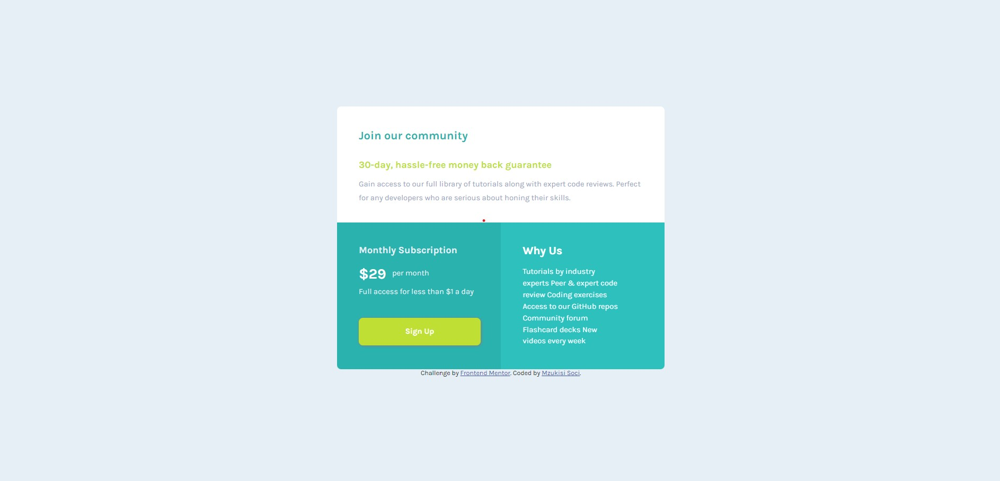

# Frontend Mentor - Single price grid component solution

This is a solution to the [Single price grid component challenge on Frontend Mentor](https://www.frontendmentor.io/challenges/single-price-grid-component-5ce41129d0ff452fec5abbbc). Frontend Mentor challenges help you improve your coding skills by building realistic projects. 

## Table of contents

- [Overview](#overview)
  - [The challenge](#the-challenge)
  - [Screenshot](#screenshot)
  - [Links](#links)
- [My process](#my-process)
  - [Built with](#built-with)
  - [What I learned](#what-i-learned)
- [Author](#author)

## Overview

### The challenge

Users should be able to:

- View the optimal layout for the component depending on their device's screen size
- See a hover state on desktop for the Sign Up call-to-action

### Screenshot




### Links

- Solution URL: [https://github.com/Mzu-Soci/Single-price-grid-component]
- Live Site URL: [https://mzu-soci.github.io/Single-price-grid-component/]

## My process

-tagged all elements and added divs for mobile site
-created and linked css file
-formated the page from the top div working my way down.
-wrote media queries for mobile site
-edited css for desktop site
-wrote media queries for desktop site.

### Built with

- Semantic HTML5 markup
- CSS custom properties
- Flexbox
- Mobile-first workflow

### What I learned

I learned how to use filter to change the color of a div. 

```css
.section_3 {
  color: white;
  background-color: hsl(179, 62%, 43%);
  filter: brightness(108%);
}
```

## Author

- Frontend Mentor - [@Mzu-Soci](https://www.frontendmentor.io/profile/Mzu-Soci)
- LinkedIn - [Mzukisi Soci](https://www.linkedin.com/in/mzukisi-soci-308521140/)